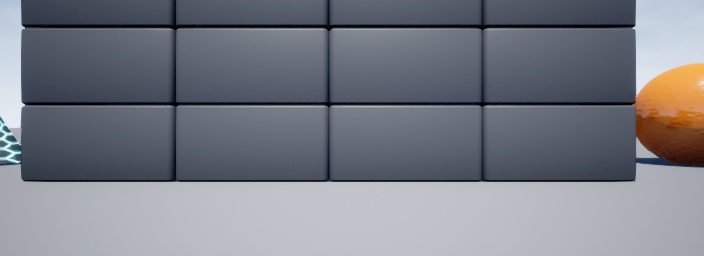
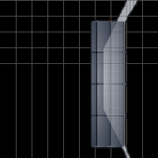

<div align="center">

# BEV Drone Project

### 无人机环境感知与鸟瞰地图构建

**AirSim · RGB-D · Geometric BEV · CLIP**

研究原型 / Research prototype

[快速体验](#快速体验) · [当前实现](#当前实现) · [目录结构](#目录结构) · [团队与参考](#团队与参考)

</div>

---

## 项目概览

本项目探索无人机环境感知与视觉语义理解：在 AirSim 仿真环境中采集图像和深度信息，通过相机参数与几何投影生成鸟瞰视角（BEV）地图，并开展 CLIP 图文编码与语义匹配的模块实验，为后续导航研究提供感知基础。

**当前主要实现的是几何 BEV 与独立模块原型，不是已完成的端到端自主导航系统。** LSS 仍包含占位逻辑，语义相似度演示使用随机 BEV 特征；这些限制在下文单独标明。

<table>
<tr>
<td width="70%" align="center"><br/><sub>AirSim 前视 RGB · 原始仿真样例</sub></td>
<td width="30%" align="center"><br/><sub>几何 BEV 投影 · 原始示例输出</sub></td>
</tr>
</table>

图片来自项目自带样例，不代表地图精度、语义识别或导航成功率的评测结果。

## 当前实现

| 模块 | 文件 | 当前状态 |
| :--- | :--- | :--- |
| 仿真连接与控制 | `simulation/hello_drone.py`、`keyboard_control.py` | 已有 AirSim 连接、起飞及键盘控制脚本；运行需要本地仿真环境。 |
| 图像与深度采集 | `simulation/capture_images.py` | 采集前视、下视 RGB 与 DepthPlanar，保存图像、深度数组和元数据。 |
| 图像预处理 | `data/dataloader.py` | 图像读取、RGB 转换、归一化、缩放与 Tensor 转换。 |
| 几何 BEV | `models/bev/bev_generator.py` | 使用 RGB、深度和配置参数进行反投影、坐标变换、栅格聚合并保存 BEV。 |
| LSS 感知骨架 | `models/bev/lss.py` | 参考 Lift-Splat-Shoot 的模块设计；几何计算和体素池化仍有 mock / TODO，不能作为完整模型使用。 |
| CLIP 编码 | `models/vlm/image_encoder.py`、`text_encoder.py` | 独立图像与文本编码模块；实际运行需模型权重与相应依赖。 |
| 相似度演示 | `models/vlm/similarity.py` | 对文本与随机生成的 BEV 特征计算余弦相似度，不是已验证的真实场景语义定位。 |
| 语言模型接口 | `models/llm/llm_client.py` | 默认 mock；可通过环境变量切换本地 Ollama，尚未与导航闭环集成。 |

目前没有发布完整的多相机学习式融合训练、闭环规划控制或导航性能评测。

## 快速体验

### 1. 离线几何 BEV 样例

不必先启动 AirSim，也不需要下载大模型。以下命令使用仓库已有样例运行几何投影模块：

```bash
git clone https://github.com/qiansen0809-droid/BEV_Drone_Project.git
cd BEV_Drone_Project
python -m venv .venv
```

激活环境（Windows PowerShell）：

```powershell
.\.venv\Scripts\Activate.ps1
```

或在 Linux / macOS 中：

```bash
source .venv/bin/activate
```

安装几何模块依赖并运行：

```bash
python -m pip install -r requirements-bev-demo.txt
python models/bev/bev_generator.py
```

输出为 `simulation/captures/bev_map.png`，会覆盖同名样例输出。默认 BEV 栅格为 `200 × 200`，参数位于 [`configs/base_config.yaml`](configs/base_config.yaml)。此步骤仅验证几何投影脚本可运行，不验证相机标定或地图几何精度。

### 2. AirSim 采集

先准备 AirSim Blocks 环境并核对 [`simulation/settings.json`](simulation/settings.json)。激活含有 AirSim、OpenCV 和 NumPy 的环境后，在项目根目录运行：

```bash
python simulation/hello_drone.py --move
python simulation/capture_images.py --vehicle-name Drone1 --height 3
python simulation/keyboard_control.py
```

这些命令会控制仿真中的无人机；需先打开仿真环境。历史批处理脚本含本地环境路径，使用前请调整。原仿真说明提到的部分根目录验收批处理文件不在本次压缩包中，以上命令直接调用现有 Python 文件。

### 3. 其他模块

[`requirements.txt`](requirements.txt) 保留原项目的历史完整依赖；其中包括特定 CUDA 版本及 Git 依赖，**不等于已经验证可在任意系统上直接安装**。按需配置对应模块，不建议为了运行离线几何示例安装整套依赖。

CLIP 编码、LSS 和真实 LLM 调用并未在本次整理中重新训练或完成端到端验证。`llm_client.py` 默认 `LLM_MODE=mock`；真实本地调用需另行配置 Ollama。

## 目录结构

```text
BEV_Drone_Project/
├── configs/                    # 相机、图像与 BEV 参数
├── data/                       # 数据处理源码；不提交新生成的数据
│   └── dataloader.py
├── models/
│   ├── bev/                    # 几何投影 + LSS 设计骨架
│   ├── vlm/                    # CLIP 图像/文本编码 + 相似度实验
│   └── llm/                    # mock / 本地 Ollama 接口
├── simulation/                 # 仿真连接、控制与采集
│   ├── captures/               # 随包提供的小型示例数据
│   └── settings.json
├── docs/
│   ├── lss_analysis.md         # 原有参考阅读笔记
│   ├── PROJECT_PLAN.original.md# 原 README 规划存档
│   └── PUBLISH_NOTES.md        # 本次整理范围与验证记录
├── requirements-bev-demo.txt   # 离线几何示例依赖
├── requirements.txt            # 原有完整依赖
└── README.md
```

## 团队与参考

原项目团队成员：**李丫馨、钱森、邢芸、朱永强**。本次整理保留原团队署名，不将团队工作或引用方法表述为个人独立原创。

本项目的研究方向包含基于 BEV 的无人机环境感知与自主导航；原始规划保存在 [`docs/PROJECT_PLAN.original.md`](docs/PROJECT_PLAN.original.md)。参考的第三方项目包括 [Lift-Splat-Shoot](https://github.com/nv-tlabs/lift-splat-shoot)、[CLIP](https://github.com/openai/CLIP) 与 [AirSim](https://github.com/microsoft/AirSim)。

---

<sub>Source code and a small simulation example. An evolving research prototype, not a production navigation system.</sub>
